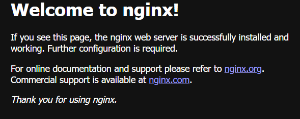
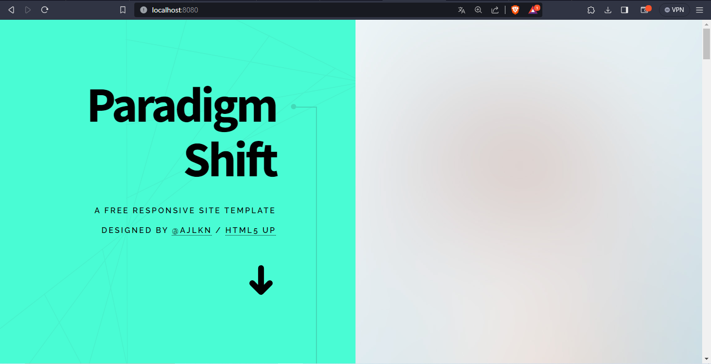
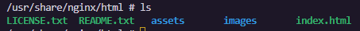

# Volúmenes

## HOST

### Volumen tipo host con la imagen nginx:alpine 
### ruta carpeta host: directorio en donde se encuentra la carpeta html en nuestro computador, usar \\
```
C:\Users\"Paul Roman"\Desktop\EPN-CES-Practica-4\"Práctica4"\html
```
### ruta carpeta contenedor: /usr/share/nginx/html desde la documentación
```
docker run -d --name <nombre contenedor> --publish <mapeo de puertos> -v <ruta carpeta host>:<ruta carpeta contenedor> url: <nombre imagen>
```
### Formato con parámetros
```
docker run -d --name nginx-4 --publish 8080:80 -v C:\Users\"Paul Roman"\Desktop\EPN-CES-Practica-4\"Práctica4"\html:/usr/share/nginx/html nginx:alpine
```


### ¿Qué sucede al ingresar al servidor de nginx?
Se muestra la pantallde inicio de nginx que indica la correcta instalación del mismo. 


### ¿Qué pasa con el archivo index.html del contenedor?
Este archivo contiene el html del mensaje de bienvenida visto previamente. 

### Ir a https://html5up.net/ y descargar un template gratuito - descomprimir en la carpeta html
### ¿Qué sucede al ingresar al servidor de nginx?
Al ingresar al localhost en el puerto 8080 se visualiza la plantilla colocada en el directorio del entorno local. 



De igual manera, ingresando al contenedor via bash se pudo apreciar que se tiene la misma información en las 2 carpertas.



### Eliminar el contenedor
Se emplea el siguiente comando para eliminar el contenedor: 

```
docker stop nginx-4
docker rm nginx-4 
```

### ¿Qué sucede al crear nuevamente el mismo contenedor con volumen de tipo host a los directorios definidos anteriormente?
Se ejecuta nuevamente el mismo comando empleado previamente 
```
docker run -d --name nginx-4 --publish 8080:80 -v C:\Users\"Paul Roman"\Desktop\EPN-CES-Practica-4\"Práctica4"\html:/usr/share/nginx/html nginx:alpine
```
De esta manera se emplean los ficheros colocados en la carpeta html en el entorno local y al visitar la dirección localhost:8080 aparece la plantilla descargada previamente.

### ¿Qué hace el comando pwd?
El comando "pwd" (print working directory) se utiliza en sistemas operativos tipo Unix y Linux para mostrar el directorio de trabajo actual en el que te encuentras. Al ejecutar el comando "pwd" en la línea de comandos, se imprimirá en la pantalla la ruta completa del directorio en el que te encuentras actualmente.


### Volumen tipo host usando PWD y PowerShell
Se emplea el comando PWD para utilizar su resultado como parte del comando de docker. 
```
docker run -d --name nginx-4-2 -p 8080:80 -v ${PWD}/html:/usr/share/nginx/html nginx:alpine
```