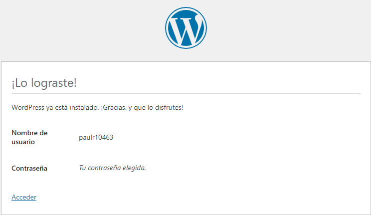
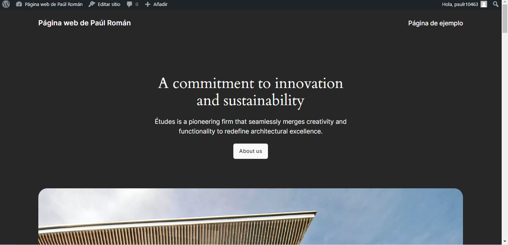
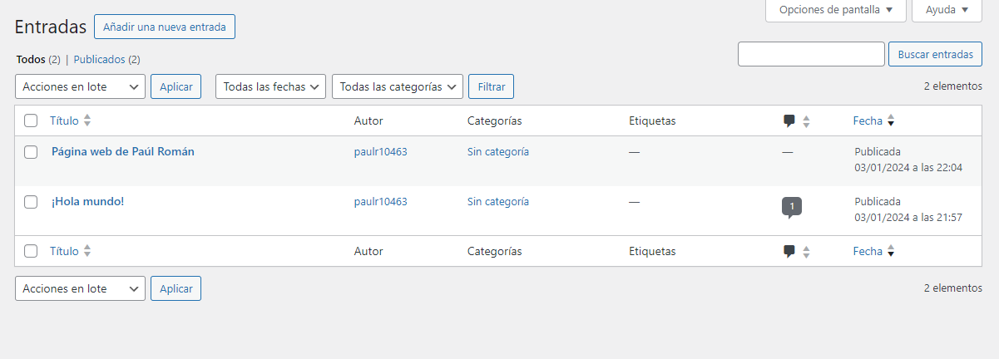
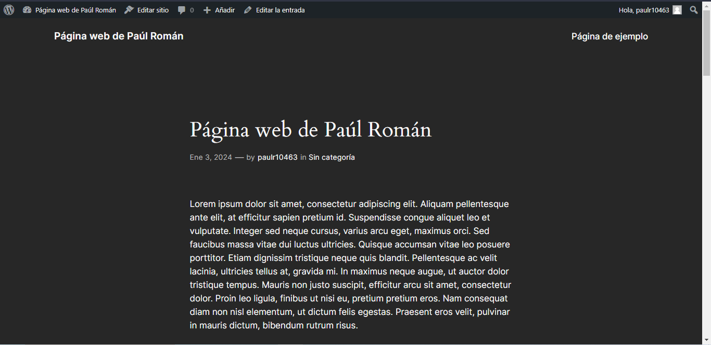

# Wordpress

### Crear red net-wp

```
docker network create net-wp
```
Este comando creará una red de tipo bridge.

### Para que persista la información es necesario conocer ¿en dónde mysql almacena la información?
MySQL guarda los datos en la carpeta /var/lib/mysql dentro del contenedor. Para asegurar la persistencia de esta información incluso en caso de que el contenedor sea eliminado o reiniciado, es esencial establecer un vínculo o un volumen entre el host y el contenedor

### ruta carpeta host: db
### Crear contenedor de MySQL en la red net-wp
```
docker run --name mysql-server-4 -e MYSQL_ROOT_PASSWORD=P@ssw0rd -e MYSQL_DATABASE=wordpress-db -e MYSQL_USER=user01 -e MYSQL_PASSWORD=P@ssw0rd -v "C:\Users\Paul Roman\Desktop\EPN-CES-Practica-4\Práctica4/2-wordpress/db:/var/lib/mysql" --network net-wp -d mysql:latest
```

### Para que persista la información es necesario conocer ¿en dónde wordpress almacena la información?
WordPress guarda los datos en dos ubicaciones distintas: la base de datos MySQL y la carpeta /var/www/html/ dentro del contenedor. En específico, el directorio wp-content alberga los archivos relacionados con temas, plugins y medios utilizados en el sitio web. Para garantizar la persistencia de esta información, se requiere establecer un vínculo o un volumen entre el host y el contenedor.

### ruta carpeta host: www
### Crear contenedor de Wordpress en la red net-wp
```
docker run --name wordpress-server -e WORDPRESS_DB_HOST=mysql-server-4 -e WORDPRESS_DB_NAME=wordpress-db -e WORDPRESS_DB_USER=user01 -e WORDPRESS_DB_PASSWORD=P@ssw0rd -v "C:\Users\Paul Roman\Desktop\EPN-CES-Practica-4/Práctica4/2-wordpress/www:/var/www/html" --network net-wp -p 80:80 -d wordpress:latest
```
### Personalizar la apariencia de wordpress y agregar una entrada
Se logró configurar el usuario y contraseña del servidor de wordpress.



Se personalizó la apariencia de wordpress usando un tema oscuro. 



En adición, se creó una entrada con el titulo de página web de Paúl Román y texto generado con lorem ipsum. 



Dicha entrada se ve así: 


### Eliminar el contenedor y crearlo nuevamente, ¿qué ha sucedido?
Se elimaron los contenedores mediante los siguientes comandos:

```
docker rm wordpress-server
docker rm mysql-server-4
```
Al volver a crear los contenedores, ya se mantiene la información en las carpetas db y www. De esta manera se consigue la permanencia de la información. Así, no es necesario volver a realizar la configuración de wordpress realizada previamente. 
